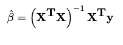
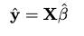
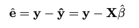
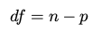
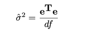
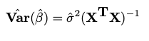
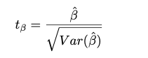

## Multiple Regression Model Analysis
**Introductıon**
This package is used for multiple regression model analysis. The function in 
this package called **linreg()**.  This function has two arguments which are **formula**
and **data**. The functıon takes these arguments and returns an **object**.

### Computations using ordinary least square

#### Regressions coefficients

  

#### The fitted values



#### The residuals




#### The degrees of freedom




#### The residual variance




#### The variance of regression coefficients




#### The t-values of each coefficients




### Example

```{r}
# create new object of Reference Class "linreg" with linreg initializer

```


```{r setup}
library(rmarkdown)
library(pander)
library(ggplot2)
library(gridExtra)
library(methods)


```


```{r, results = "asis"}
linreg<-setRefClass("linreg",
                    fields=list(formula='formula',data='data.frame',data_name="character",
                                coefficients="numeric", resids="numeric",
                                predictors="numeric",df="numeric",
                                summ="data.frame",resid_se="numeric",res_var="numeric"),
                    methods=list(
                      pred=function(){

                        return(predictors)
                      },
                      resid=function(){

                        return(resids)
                      },
                      coef=function(){

                        return(coefficients)
                      },
                      print=function(){

                        cat(paste("linreg(formula = ",format(formula),", data = ",data_name,")\n\n",sep=""))

                        x<-data.frame(t(coefficients))

                        colnames(x)<-names(coefficients)

                        write.table(x,sep="   ",quote=FALSE)

                      },
                      summary=function(){

                        summ<-round(summ,digits=3)


                        for (i in 1:length(summ[,4])) {

                          if (summ[i,4]<-2.2*10^(-16)) {
                            summ[i,'4']<-"****"
                          }

                        }

                        colnames(summ)<-NULL

                        write.table(summ,sep=" ", quote=FALSE)

                        cat("Residual standard error:",round(resid_se,digits=2),"on",df,"degrees of freedom")


                      },
                      plot=function(){


                        pl1<-ggplot()+

                          theme(
                            panel.grid.major=element_blank(),
                            panel.grid.minor=element_blank(),
                            plot.title=element_text(hjust=0.5),
                            panel.background = element_rect(fill='transparent'))+

                          geom_point(aes(x=predictors, y=resids), size=4, shape=21 )+

                          geom_smooth(aes(x=predictors, y=resids),

                                      formula=y~x, method="loess",color='red', se=F)+

                          geom_hline(aes(yintercept =0),linetype="dashed")+

                          xlab(label=paste("Fitted values\n","lm(",format(formula),")"))+

                          ylab("Residuals")+

                          ggtitle("Residuals vs Fitted")


                        std_res <- resids/res_var

                        pl2<-ggplot()+

                          theme(
                            panel.grid.major=element_blank(),
                            panel.grid.minor=element_blank(),
                            plot.title=element_text(hjust=0.5),
                            panel.background = element_rect(fill='transparent'))+

                          geom_point(aes(x=predictors, y=std_res), size=4, shape=21 )+

                          geom_smooth(aes(x=predictors, y=std_res),

                                      formula=y~x, method="loess",color='red', se=F)+

                          xlab(label=paste("Fitted values\n","lm(",format(formula),")"))+

                          ylab(expression(sqrt("Standardized Residuals")))+

                          ggtitle("Scale-Location")

                          grid.arrange(grobs=list(pl1,pl2))
                      }
                    )
)
#initialize object

linreg$methods(initialize=function(formula,data){

  .self$formula<<-formula

  .self$data<<-data

  .self$data_name<<-deparse(substitute(data))

  #model matrix or X

  mm<-model.matrix(formula,data)

  #response data

  y<-as.matrix(data[,all.vars(formula)[1]])

  #regression coefficients

  betta<-solve((t(mm)%*%mm))%*%t(mm)%*%y

  .self$coefficients<<-round(betta[,1],digits=2)

  #fitted values

  y_fitted<-mm%*%betta

  .self$predictors<<-as.vector(y_fitted)

  #residuals

  res<-y-y_fitted

  .self$resids<<-as.vector(res)

  #degress of freedom

  df1<-dim(mm)[1]-dim(mm)[2]

  .self$df<<-df1

  #residual variance

  sgm_2<-(t(res)%*%res)/df1

  .self$res_var<<-as.vector(sgm_2^0.5)

  #variance of regression coefficients

  var_betta<-sgm_2[1,1]*solve(t(mm)%*%mm)

  #eliminate negative cov values

  ref_var_betta<-c()

  for (i in 1:dim(var_betta)[1]){
    ref_var_betta<-c(ref_var_betta,var_betta[i,i])
  }

  #t-values for each coefficient

  t_val<-betta/as.matrix(ref_var_betta^0.5)

  #p-values for each regression coefficient

  p_val<-pt(q=abs(as.vector(t_val)), df=df1,lower.tail=FALSE)

  #summary for summary function

  summat<-data.frame(Estimate=as.vector(betta),Std.Error=ref_var_betta^0.5,
                     t_value=as.vector(t_val),p_value=p_val)

  rownames(summat)<-rownames(betta)

  .self$summ<<-summat

  residual_se<-sqrt(sum(res^2)/148)

  .self$resid_se<<-residual_se

  cat("Well done, my brave knight. Now...off with your head.\n")
})

lrm <- linreg$new(Petal.Length~Species, data=iris)


```

#### resid() method

```{r}
##this method returns vector of residuals

lrm$resid()

```
#### pred() method

```{r}
##this method  returns fitted values of y

lrm$pred()

```


```{r}
##this method returns regression coefficients

lrm$coef()

```


```{r}
##this method returns summary of "linreg" class 

lrm$summary()

```


```{r}
## this method returns linreg class inputs with regression coefficients

lrm$print()

```


```{r}
##this methods returns two plots

lrm$plot()

```
